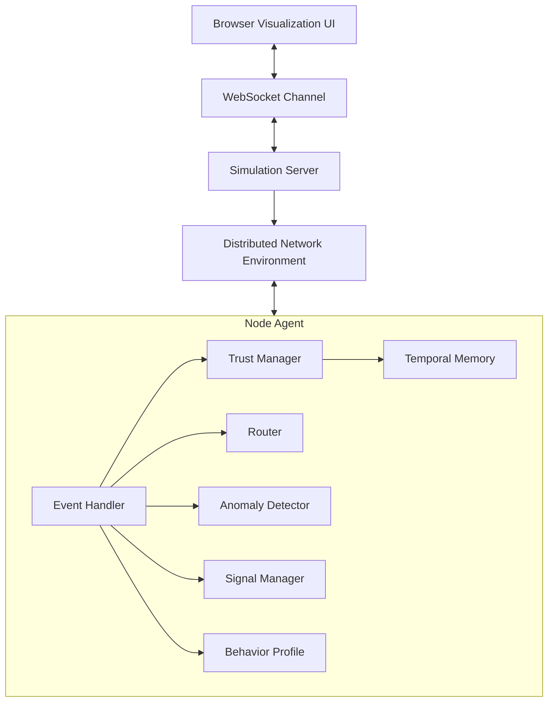
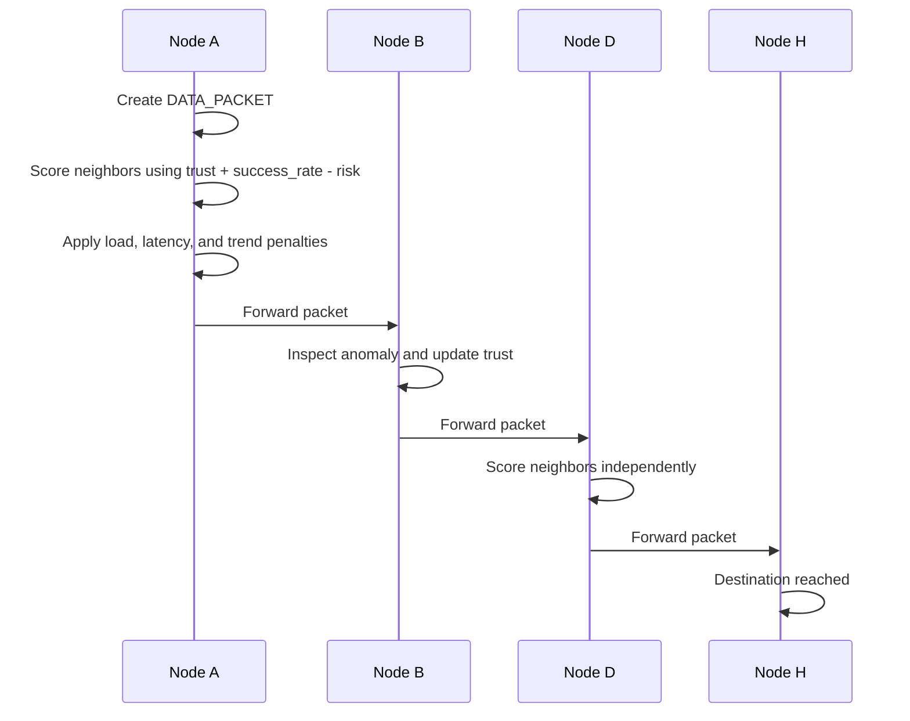
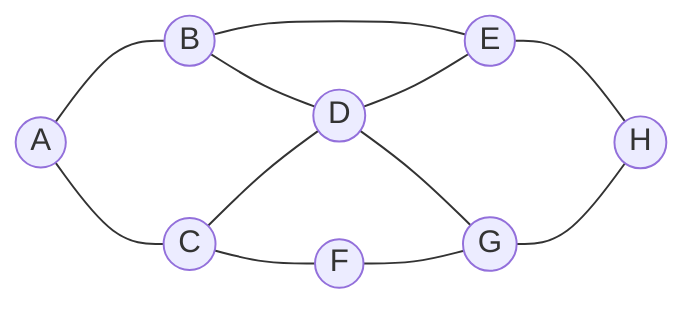
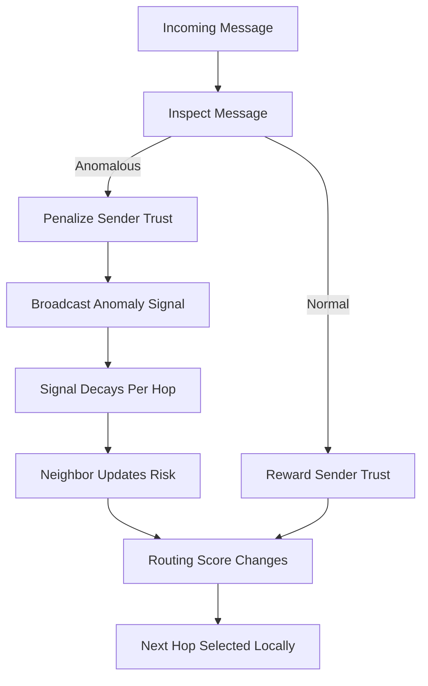
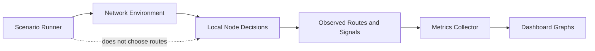

# Diagrams

Paste these Mermaid diagrams into any Mermaid renderer, GitHub Markdown preview, or documentation tool that supports Mermaid.

## System Architecture Diagram

## Data Flow Diagram

## Node Interaction Diagram

## Trust and Signal Feedback Loop

## Experiment and Metrics Diagram

